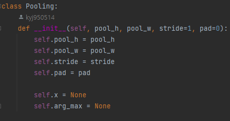

## People

* [YoungJeansKR](https://github.com/youngjeanskr "김영진")
* [haen-su](https://github.com/haen-su "김현수")
* [ch9eri](https://github.com/ch9eri "임채리")

## Language / IDE

* 
* 
* 
* 
* 

## Dataset

* 2140 images
* 2140 xml files

  
 

## Model

* CNN (Conv - ReLU - Pooling - Conv - ReLU - Pooling - Affine - ReLU - Affine - Sigmoid )

## Optimizer

* SGD, Momentum, Adam
* Lr = 0.001, 0.01, 0.1
* Batch size = 32, 64
* Epochs = 20, 50, 100

## Implementation Example Code

 
 
 
 
 
 
 
 
 
 
 
 
 

## Result

* Train Accuracy : 89.91%
* Test Accuracy : 77.32%

